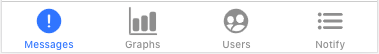

The ***Noditor App*** is a progressive web app (PWA). It will connect to your self-hosted instance of the Noditor Server to render messages and graph data collected from all your applications. 

As a PWA you can install it directly to the home screen of a mobile device. Doing so allows the Noditor App access to more screen space.

## Authenticate

The Noditor App uses a simple email-code-token mechanism.

- Run the [Noditor App](https://www.noditor.com/app).

- Enter your email address.

- Check your email application for a code.

- Enter the code into the Noditor App.

The Noditor App will remember you each time you return. Simply logout if wish not to be remembered.

## Navigation

The Noditor App uses a simple tab system to access different sections of logical data.

- Messages (Alerts and Errors)

- Graphs

- Users (View users and manage their access)

- Notify (View system notifications)

## User Management

Only Administrators can add, edit or delete users. Administrators are defined in the [noditor.json](server/main.md?id=Configuration) file. All other users are added using the Noditor App and are only allowed to view the list of users.

#### Add User

- Select the ***Users*** tab to access the Users List.

- Select the <i class="fa fa-plus"></i> icon.

- Enter the user's ***Email Address***.

#### Edit User

- Select the desired ***User*** from the User List.

- Change the email address.

#### Delete User

- Select the desired ***User*** from the User List.

- Select the <i class="fa fa-trash"></i> icon.

## Notifications

The Notify Tab loads a list of ***Notifications*** sent to you. Notifications are sent when your Application sends a message (alert or error) with the [notify flag](server/messages.md?id=Messages) set to true.

Other notifications will include those from the Noditor Server itself regarding issues deemed important. The following is a partial list.

- Invalid key used.

- Invalid host or ip address.

- Database size close to filling available disk space. 
