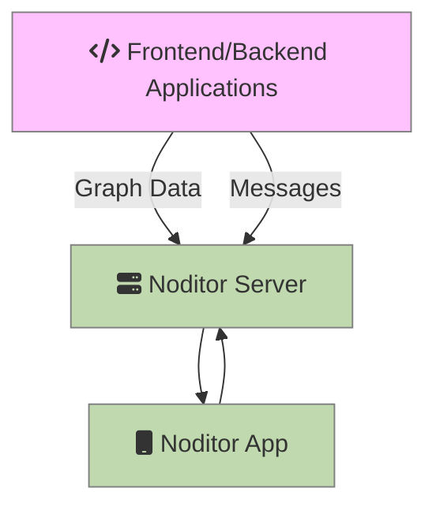

***Noditor*** is a light-weight self hosted monitoring system for your frontend or backend Applications. It consists of two parts: the ***Noditor Server*** and the  ***Noditor App***. Noditor is an open source project hosted on GitHub in three repos: noditor-docs,  noditor-server and noditor-app.

Noditor as a monitoring system is not a replacement for the major players in the monitoring business but it does not overwhelm your Applications like they do. It provides just enough insight to know if you have an issue and what it might be. From there: you know best.

Noditor is suitable for production systems.

> [!ATTENTION|label:Analytics]
> Noditor is currently not a collection system for analytics. Send important errors, alerts or other messages along with graph data. Analytics are however in the development pipeline.

## Noditor Server

The ***Noditor Server*** hosts a set of REST endpoints and is written in Node.js/Express. Applications written in any language can communicate with the Noditor Server using HTTPS.

The Noditor Server receives messages and graph data from your Applications and stores everything in a local SQLite3 database. The same set of APIs delivers data to the Noditor App.

You can host the Noditor Sever anywhere you want (in-house or cloud). It only contains your data and is managed by the Noditor App.

 To install the Noditor Server see the [Getting Started](getstarted.md?id=Getting-Started) section of this guide.

## Noditor App

The ***Noditor App*** is a Progressive Web App (PWA). It will connect to your self-hosted instance of the Noditor Server to render messages and graph data collected from all your applications. Noditor App is also used to manage Keys and Users on the Noditor Server.  

The Noditor App is available directly from the [Noditor App Repo](https://github.com/wkande/noditor-app) on GitHub or in this guide under the [Noditor App](../app/main.md?id=Overview) section.

[filename](getstarted.md ':include')
