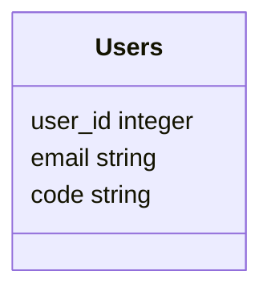
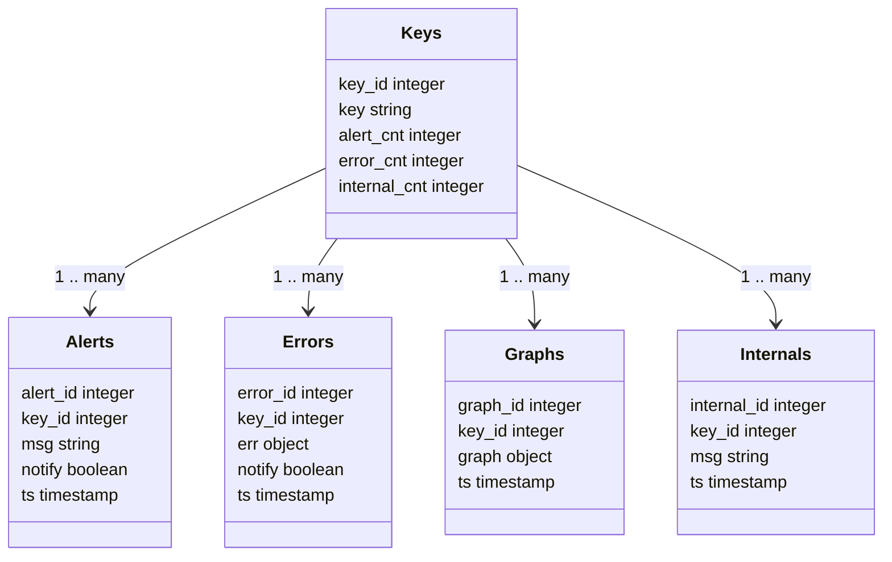

# SQLite3 Database

The Noditor Server creates a local ***SQLite3 Database*** to record data from your Applciations and other data created by the Noditor App.

This database is automatically managed by the Noditor Server. Only the TTL (Time-To-Live) parameter can be altered.

## Time-To-Live

By default the Noditor Server deletes any data older than seven days. You can adjust this value in the noditor.json config file.

The noditor.json file is not included in the cloned noditor-server repo. You must create it in the project root and enter a JSON object using the following structure. The ***ttl*** key is optional. You can set it to keep data for any duration except forever. Set the value in days.

```json
{
  "administrators":["warren@wyosoft.com"],
  "ttl":30,
  "allowed_addresses":["*"]
}
```

Changing the ttl value **does not** require the server to be restarted.

Learn more about the [noditor.json](../server/config.md?id=Configuration) file in the Noditor Server section of this guide.

## Database Tables

| Name        | Description |
| :---        | :--- |
| USERS       | Authorized email addresses that can use the Noditor App. |
| KEYS        | Known keys than can send messages and graph data to the Noditor Server. |
| ALERTS      | Alert messages sent to the Noditor Server. |
| ERRORS      | Error messages sent to the Noditor Server. |
| GRAPHS      | Graph data sent to the Noditor Server. |
| INTERNALS   | Noditor Server internal messages sent to the Noditor App. |




