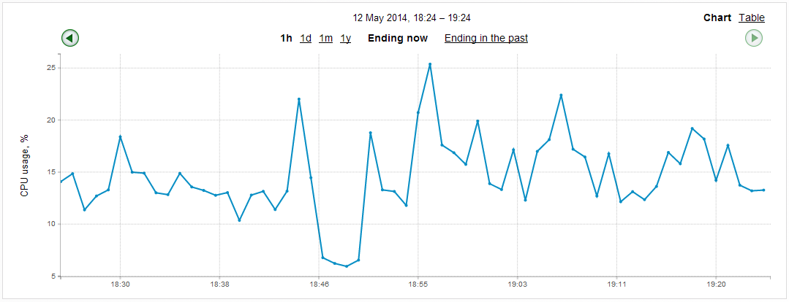

# Graphs

Your Applciatinos can send graph data to the Noditor Server. The Noditor App can render the graph data in several different chart styles.

* **key** - string: a known Key on the Noditor Server
* **name** - name: unique name for the chart
* **ts** - timestamp: the timestamp point on the graph
* **value** - number: value of the graph point

In the following example the current CPU utilization is sent to the POST /graph endpoint. Your Application might make this call every minute. The Noditor Server will aggregate all data associated with the name ***CPU Usage*** into one chart via the Noditor App.

The ***name*** is case sensitive at the Noditor Server. ***CPU Usage*** and ***cpu Usage*** will be two different charts.

```curl
curl -d '{"key":"my-key", \
          "name":"CPU Usage", \
          "ts":now(), \
          "value":13 \
         }' \
-H 'Content-Type: application/json' \
-X POST https://www.mydomain.com/graph 
```


The line chart below shows an aggregate set of points from the database sent over time. Notice that the last point on the chart is 13, the point sent in the example above.

##### CPU Usage



Learn more about calling the POST /graph endpoint in the [API Reference](../api/graph-create) section of this guide.