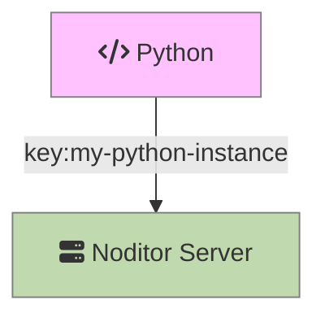
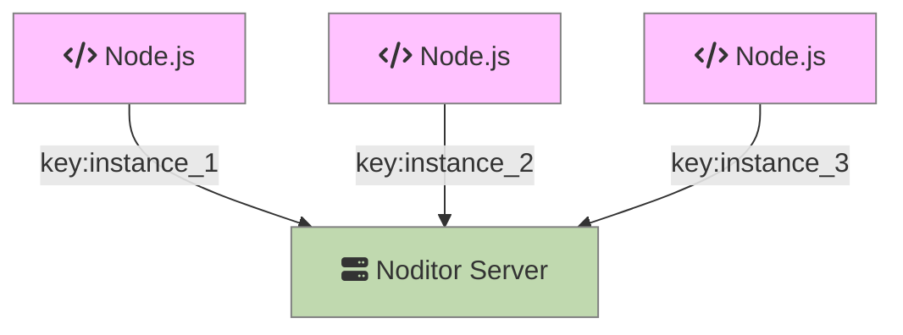
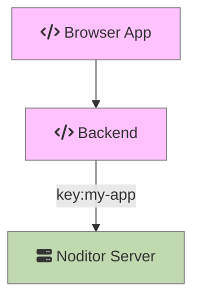

# Keys

Keys are used to relate messages and graph data into a logical group. The list of keys must be unique. You [create keys]() using the Noditor App or by calling the POST /key endpoint.

When keys are used as designed, the Noditor App will present a list of all your Keys. Clicking on a Key will show its messages by type (alerts and errors) and graphs related to the graph data you have send using the Key.

The best way to explain the use of keys in your Application is by example.

#### Backend App (single instance)

You are running a single instance of a backend application. Use the same ***Key*** when calling any API on the Noditor Server. This keeps the data from the instance separate from data of another application using a different key.  

#### Backend App (multiple instances)

You are running multiple instances of a backend application. Use a different ***Key*** for each instance when calling any API on the Noditor Server. This keeps the data of each instance separate.  

#### Frontend App

You have a desktop browser app. Use the same ***Key*** when calling any API on the Noditor Server. This keeps the data from the frontend app separate from the data of other desktop, mobile or backend applications. For frontend applications never store the key in the application. Call your backend server and have it call the Noditor Server with the Key.

