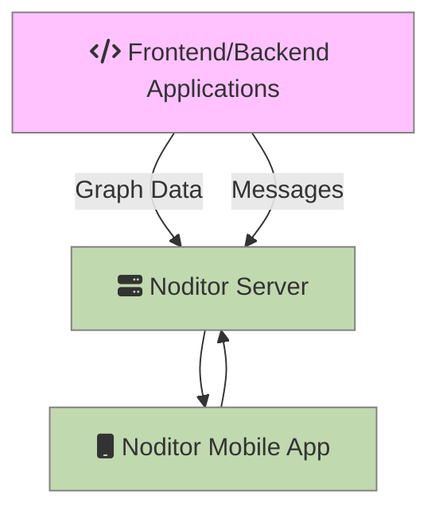

# Architecture

***Applications*** (your frontend or backend applications) push messages and graph data directly to the Noditor Server.  

The ***Noditor Server*** stores everything locally in a SQLite3 database. Applications written in any language will work as long as they can communicate with the Noditor Server using HTTPS. You can host the Noditor Sever anywhere you want. It only contains your data and is managed by the Noditor Mobile App.

The ***Noditor Mobile App*** (PWA) will access the Noditor Server to render graphs and list messages. 

